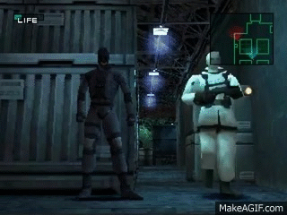

# IoT-Desktop-Security
With a raspberry Pi, a PIR motion sensor, and PubNub's publishing and subsribing tech you can create your own desktop security. A trigger of the motion sensor will publish a messaged through PubNub's network and send a message straight to an app you can download on your phone alerting you of an intruder. You can set this motion where ever in your office. It also leaves room for added features like a raspberry Pi camera that can take a picture of the intruder or if you wanted to put a boomer in to make a noise when motion has been detected.

# Requirements to run:
* Latest version of Python
* PubNub's sdk's for python and react installed
* React Native CLI
* Xcode and iOS simulator
* Things like react-native-modal or react-navigation installed and link if you wanted to intergrate that into your app

